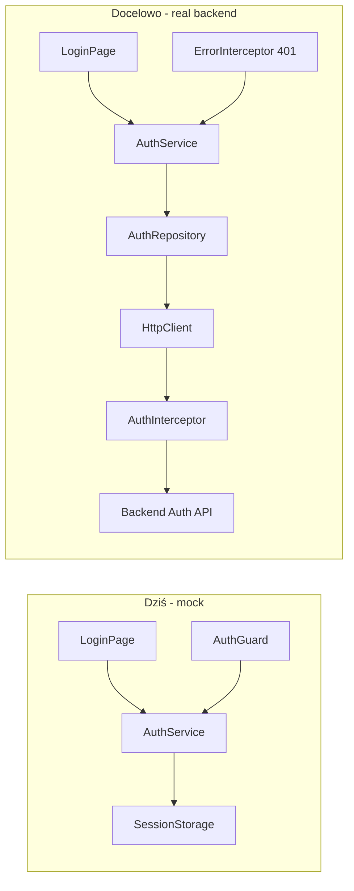
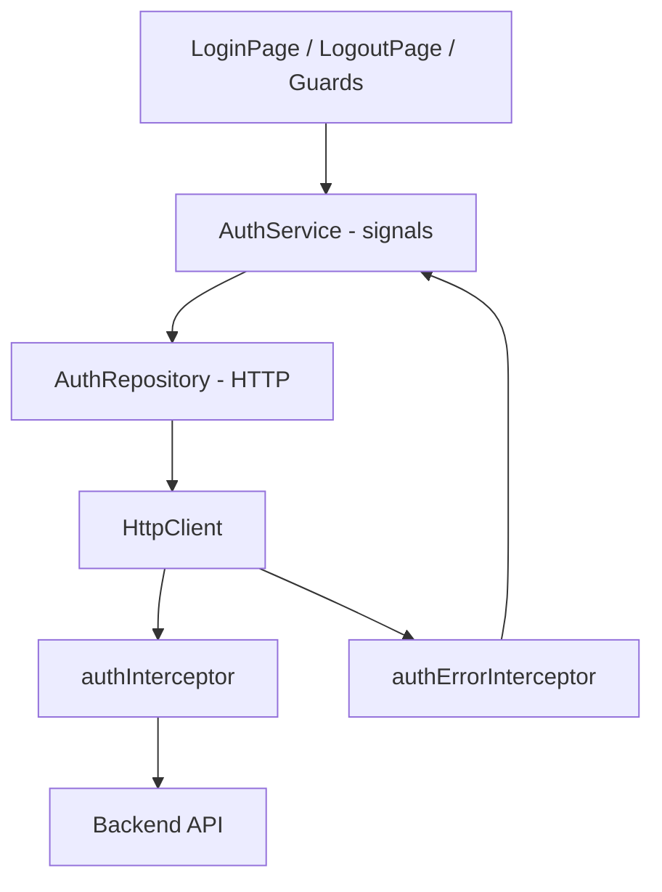

# Instrukcja: rozwój autoryzacji

**Zakres:** roadmapa przejścia z obecnego mock-auth (stałe demo + `sessionStorage` + funkcyjne guardy) do realnej autoryzacji opartej o backend, ze szczególnym uwzględnieniem Angular 21, hybrydowego SSR i pełnego pokrycia testami (Vitest + Playwright + AXE).

**Status:** instrukcja — dokument decyzyjny. Implementacja po akceptacji wariantu kontraktu z backendem (sekcja [Decyzje do podjęcia](#decyzje-do-podjęcia)).

---

## Kontekst — stan obecny

Wszystko poniżej istnieje już w repo i działa jako mock; instrukcja zachowuje obecne API publiczne `AuthService` tam, gdzie to możliwe (`session()`, `isAuthenticated()`, `login()`, `logout()`), żeby refaktor nie kaskadował na komponenty.

| Element | Plik | Rola dziś |
|---------|------|-----------|
| Serwis | [auth.service.ts](../src/app/features/auth/services/auth.service.ts) | Walidacja względem stałych `DEMO_EMAIL` / `DEMO_PASSWORD`, `delay(300)`, sesja w `sessionStorage` pod kluczem `app-auth-session` |
| Typ sesji | [auth-session.interface.ts](../src/app/features/auth/types/auth-session.interface.ts) | `{ email, loggedInAt }` — brak tokenu, ról, wygaśnięcia |
| Guard auth | [auth.guard.ts](../src/app/features/auth/guards/auth.guard.ts) | `CanActivateFn` — `isAuthenticated()` lub redirect na `/login` |
| Guard guest | [guest.guard.ts](../src/app/features/auth/guards/guest.guard.ts) | Odwrotnie — zalogowany na `/login` → `/dashboard` |
| Routing | [app.routes.ts](../src/app/app.routes.ts) | `authGuard` na `dashboard`, `products-stock`, `favourites` |
| Login UI | [login-page.ts](../src/app/features/auth/pages/login-page/login-page.ts) | Reactive form (`email`, `password`, `rememberMe`), Material, `OnPush` |
| Logout | [logout-page.ts](../src/app/features/auth/pages/logout-page/logout-page.ts) | Komponent bez templatki — `authService.logout()` + redirect |
| HTTP | [app.config.ts](../src/app/app.config.ts) | `provideHttpClient(withFetch())` — **brak** `withInterceptors` |
| SSR | [app.routes.server.ts](../src/app/app.routes.server.ts) | `/login` = `RenderMode.Prerender`, reszta = `RenderMode.Client` |
| Testy jednostkowe | [auth.service.spec.ts](../src/app/features/auth/services/auth.service.spec.ts), [auth.guard.spec.ts](../src/app/features/auth/guards/auth.guard.spec.ts), [guest.guard.spec.ts](../src/app/features/auth/guards/guest.guard.spec.ts), [login-page.spec.ts](../src/app/features/auth/pages/login-page/login-page.spec.ts) | Vitest + `TestBed`, `vi.useFakeTimers()` |
| E2E | [login.spec.ts](../e2e-tests/auth/login.spec.ts), [login-as-demo-user.util.ts](../e2e-tests/utils/login-as-demo-user.util.ts) | Playwright; hasła demo zaszyte w utilu |



---

## Decyzje do podjęcia

Dwie decyzje blokują implementację — bez nich nie da się wybrać strategii tokenów ani konfiguracji CORS. Obie powinny zostać zaakceptowane przed startem prac:

1. **Backend autoryzacji** — czy istniejący [admin-panel](../../admin-panel/app.js) (Express + Jade) ma zostać rozszerzony o `/api/auth/*`, czy auth dostarcza osobny serwis (np. już istniejące API produktowe, brama OIDC). Wpływa na:
   - URL bazowy w `environment`,
   - CORS (`withCredentials`, `Access-Control-Allow-Origin` musi być **konkretną** domeną przy ciasteczkach, nie `*`),
   - dostępność trybu BFF / same-origin.
2. **Model sesji** — JWT w pamięci/sessionStorage vs cookie httpOnly (rekomendacja: cookie httpOnly, jeśli backend jest pod naszą kontrolą). Tabela porównawcza w sekcji [Model sesji](#model-sesji).

Pozostałe (role/uprawnienia, refresh, „remember me”) można odłożyć, ale warto je wstępnie zaplanować — patrz [Funkcje opcjonalne](#funkcje-opcjonalne).

---

## Checklist implementacji

Kolejność dobrana tak, by każdy krok dało się scalić niezależnie i przeglądać w PR ~200–400 linii.

- [ ] Zaktualizować [environments](../src/environments) (utworzyć, jeśli nie ma): `apiBaseUrl`, `useMockAuth: boolean`
- [ ] Wprowadzić `AuthRepository` (cienki klient HTTP) — `login`, `logout`, `me`, opcjonalnie `refresh`
- [ ] Rozszerzyć `AuthSession` o pola zwracane przez API (token? expiry? roles?) — patrz [Model sesji](#model-sesji)
- [ ] `AuthService`: zachować publiczne API, ale delegować do `AuthRepository`; pod flagą `useMockAuth` zachować obecne demo dla rozwoju lokalnego
- [ ] `provideHttpClient(..., withInterceptors([authInterceptor, authErrorInterceptor]))` — patrz [Interceptory](#interceptory)
- [ ] Obsługa `401`: globalny redirect na `/login?returnUrl=...` + `authService.logout()` bez podwójnego redirectu
- [ ] `LoginPage`: obsłużyć `returnUrl` z query params; spójny komunikat błędu z `INVALID_CREDENTIALS_MESSAGE`
- [ ] Vitest: zaktualizować [auth.service.spec.ts](../src/app/features/auth/services/auth.service.spec.ts) — `provideHttpClientTesting()` zamiast stałych demo
- [ ] Playwright: [login-as-demo-user.util.ts](../e2e-tests/utils/login-as-demo-user.util.ts) czyta z `process.env` (`E2E_USER_EMAIL`, `E2E_USER_PASSWORD`) z fallbackiem na demo; konfiguracja w `playwright.config.ts`
- [ ] Aktualizacja [README.md](../README.md): jak uruchomić lokalnie z mockiem i z prawdziwym API

---

## Model sesji

| Cecha | JWT w `sessionStorage` | JWT w pamięci + refresh w cookie httpOnly | Sesja cookie httpOnly (BFF) |
|-------|-----------------------|------------------------------------------|------------------------------|
| Ochrona przed XSS | Słaba (token w JS) | Średnia (access krótkoterminowy w JS) | Najlepsza (JS nie dotyka tokenu) |
| Ochrona przed CSRF | Brak ryzyka (Bearer header) | Wymaga CSRF token dla refresh | Wymaga CSRF token / `SameSite=Lax` |
| Wymagania backendu | Minimalne | Refresh endpoint + cookie | Endpoint sesyjny + cookie + same-origin/BFF |
| SSR-friendly | Nie (brak tokenu na serwerze przy SSR) | Częściowo | Tak (cookie idzie z żądaniem SSR) |
| Złożoność klienta | Najniższa | Średnia (kolejka żądań w trakcie refreshu) | Najniższa (przeglądarka sama wysyła cookie) |
| Rekomendacja | Tylko prototyp | Domyślny wybór, jeśli backend wspiera refresh | Najlepszy, jeśli admin-panel hostuje API |

**Rekomendacja domyślna:** cookie httpOnly z `SameSite=Lax` + `Secure` w produkcji, gdy admin-panel hostuje API. Jeśli auth idzie do zewnętrznego serwisu pod inną domeną — JWT z refreshem w httpOnly cookie.

`AuthSession` po refaktorze (przykład minimalny — pola dodajemy zgodnie z odpowiedzią `/me`):

```typescript
export interface AuthSession {
  email: string;
  loggedInAt: string;
  expiresAt?: string;
  roles?: readonly string[];
}
```

Tokenu **nie** trzymamy w `AuthSession` typowanym dla widoków — jeżeli wariant JWT, token przechowuje prywatne pole `AuthService` (in-memory `signal<string | null>`); `sessionStorage` używamy tylko jeśli świadomie godzimy się na ryzyko XSS.

---

## Kontrakt z backendem

Sekcja do uzupełnienia po decyzji #1. Poniżej szkielet kontraktu, który warto przedyskutować z autorem backendu **przed** kodowaniem:

| Endpoint | Metoda | Body / Query | Sukces | Błędy |
|----------|--------|--------------|--------|-------|
| `/api/auth/login` | POST | `{ email, password, rememberMe? }` | `200` + `{ user, expiresAt }` (cookie) lub `{ accessToken, user, expiresAt }` (JWT) | `401` `{ code: 'INVALID_CREDENTIALS', message }`, `429` rate limit |
| `/api/auth/logout` | POST | — | `204` (czyści cookie / unieważnia token) | `401` ignorowany na kliencie |
| `/api/auth/me` | GET | — | `200` + `{ user, expiresAt }` | `401` → logout |
| `/api/auth/refresh` (jeśli JWT) | POST | — (refresh w cookie) | `200` + `{ accessToken, expiresAt }` | `401` → logout |

**Założenia minimalne:**

- Format błędów spójny w całym API (`{ code, message }`), żeby `authErrorInterceptor` mógł je rozpoznać bez parsowania tekstu.
- Czas życia: access ~15 min, refresh ~7 dni (do ustalenia z backendem).
- CORS: konkretna domena w `Access-Control-Allow-Origin`, `Access-Control-Allow-Credentials: true`, lista nagłówków obejmująca `Content-Type` (oraz `Authorization` przy JWT).
- Cookies: `HttpOnly`, `Secure` (prod), `SameSite=Lax` (lub `Strict` jeśli nie ma cross-site redirectów).

---

## Plan implementacji w Angular

### Warstwy



### `AuthRepository` — nowy plik

Lokalizacja: `src/app/features/auth/services/auth.repository.ts`. Konwencja taka sama jak [favourites.repository.ts](../src/app/features/favourites/services/favourites.repository.ts) — `@Injectable({ providedIn: 'root' })`, metody zwracają `Observable`.

```typescript
@Injectable({ providedIn: 'root' })
export class AuthRepository {
  private readonly http = inject(HttpClient);
  private readonly env = inject(APP_ENVIRONMENT);
  private readonly baseUrl = `${this.env.apiBaseUrl}/auth`;

  public login(body: LoginRequest): Observable<AuthLoginResponse> {
    return this.http.post<AuthLoginResponse>(`${this.baseUrl}/login`, body, {
      withCredentials: true,
    });
  }

  public logout(): Observable<void> {
    return this.http.post<void>(`${this.baseUrl}/logout`, {}, { withCredentials: true });
  }

  public me(): Observable<AuthMeResponse> {
    return this.http.get<AuthMeResponse>(`${this.baseUrl}/me`, { withCredentials: true });
  }
}
```

### `AuthService` — refaktor

Zachować publiczne API (`session`, `isAuthenticated`, `login`, `logout`). Wewnętrznie:

- `login()`: deleguje do `AuthRepository.login()`, mapuje odpowiedź na `AuthSession`, zapisuje w stanie (signal) oraz — zależnie od wariantu — w pamięci/sessionStorage.
- `logout()`: woła `AuthRepository.logout()` (best-effort, ignorujemy 401), czyści signal i storage.
- `restoreSession()`: na bootstrapie wywołuje `me()`; przy 401 ustawia `null`. Wywoływane np. przez `provideAppInitializer` w `app.config.ts`.
- `useMockAuth` (z `inject(APP_ENVIRONMENT)` / bootstrap): jeśli `true`, zachowujemy obecne demo (sekcja [Tryb mock](#tryb-mock-w-dev)).

### Interceptory

Lokalizacja: `src/app/features/auth/interceptors/`.

- **`authInterceptor`** — dodaje `Authorization: Bearer <token>` (wariant JWT) lub `withCredentials: true` (cookie), pomija żądania spoza `apiBaseUrl`.
- **`authErrorInterceptor`** — na `401` woła `authService.logout()` (lokalny stan) i `router.navigateByUrl('/login?returnUrl=' + currentUrl)`. Chroni przed pętlą, jeśli 401 przyszło z samego `/auth/login`.

Aktualizacja [app.config.ts](../src/app/app.config.ts):

```typescript
provideHttpClient(
  withFetch(),
  withInterceptors([authInterceptor, authErrorInterceptor]),
),
```

### Tryb mock w dev

`environment.useMockAuth = true` zostawia ścieżkę z `DEMO_EMAIL` / `DEMO_PASSWORD` — przydatne, gdy backend nie jest jeszcze gotowy. **Produkcyjny build** musi mieć `useMockAuth: false`; warto dodać assert w `AuthService` w trybie produkcyjnym (`isDevMode()`), żeby nie wypuścić demo na świat przez przypadek.

---

## SSR i bezpieczeństwo

Hybrydowy SSR ([app.routes.server.ts](../src/app/app.routes.server.ts)) działa dobrze z każdym wariantem — pod warunkiem, że pamiętamy o ograniczeniach:

- `/login` jako `Prerender` to **statyczny HTML** — nie próbujemy w nim zaglądać do sesji.
- Trasy z `authGuard` są `RenderMode.Client` — guard wykonuje się po hydratacji, więc decyzja „pokaż / przekieruj” zapada w przeglądarce. To jest spójne dziś (`sessionStorage`) i pozostanie spójne dla wariantu JWT-in-memory.
- Jeśli wybierzemy cookie httpOnly **i** chcemy SSR autoryzowanych tras: konieczna jest konfiguracja [server.ts](../src/server.ts) (przekazywanie ciasteczek z `req` do `HttpClient` w SSR przez `REQUEST_CONTEXT` / `TransferState`) — to jest osobna decyzja, **poza zakresem MVP**.

**Hartowanie:**

- `Content-Security-Policy` po stronie hostingu — w szczególności `script-src 'self'`, żeby ograniczyć ryzyko XSS przy JWT-in-storage.
- Brak tokenów / haseł w logach (Playwright trace, `console.log`).
- `sessionStorage` zamiast `localStorage` — token znika z zamknięciem karty.

---

## Testy

### Vitest

W testach jednostkowych **nie używamy** `vi.mock` na `environment` — bundler Angulara ładuje moduł środowiska w wspólnych chunkach, więc mok nie obowiązuje spójnie. Zamiast tego konfiguracja API i `useMockAuth` idą przez **`APP_ENVIRONMENT`** (`InjectionToken`); w `TestBed` podajemy `{ provide: APP_ENVIRONMENT, useValue: {...} }`. Wspólny adres testowego API: [unit-test-api-environment.ts](../src/test/unit-test-api-environment.ts).

[auth.service.spec.ts](../src/app/features/auth/services/auth.service.spec.ts) (tryb mock): `useValue` wskazuje na [environment.ts](../src/environments/environment.ts) (dev).

```typescript
TestBed.configureTestingModule({
  providers: [
    provideHttpClient(),
    provideHttpClientTesting(),
    { provide: APP_ENVIRONMENT, useValue: environment },
  ],
});
```

[W globalnym setupie](../angular.json) testów wywołujemy [`TestBed.resetTestingModule()`](../src/test-setup.ts) w `afterEach`, żeby uniknąć „sticky” stanu między plikami (Vitest w integracji Angulara domyślnie ma `isolate: false`).

Scenariusze do utrzymania / dodania:

- Login sukces → `AuthSession` ustawiony, `isAuthenticated()` = `true`.
- Login `401` z body `{ code: 'INVALID_CREDENTIALS' }` → komunikat zgodny z `INVALID_CREDENTIALS_MESSAGE`.
- `restoreSession()` po `/me` 200 → sesja przywrócona.
- `restoreSession()` po `/me` 401 → sesja `null`, brak redirectu (redirect robi guard).
- `logout()` woła `POST /auth/logout` raz, czyści stan nawet jeśli żądanie się nie powiedzie.
- `authErrorInterceptor` na 401 z chronionego endpointu → `router.navigateByUrl` z `returnUrl`.

### Playwright

- [login-as-demo-user.util.ts](../e2e-tests/utils/login-as-demo-user.util.ts) — czyta dane z `process.env.E2E_USER_EMAIL` / `E2E_USER_PASSWORD`, fallback na demo gdy nieustawione.
- Nowy scenariusz w [login.spec.ts](../e2e-tests/auth/login.spec.ts): wygaśnięcie sesji (mock przez `page.route('**/api/**', r => r.fulfill({ status: 401 }))`) → użytkownik wraca na `/login` z `returnUrl`.
- AXE: utrzymać 0 violations na `/login` (już pokryte w [accessibility.spec.ts](../e2e-tests/accessibility/accessibility.spec.ts)).
- W CI **nie** używać konta produkcyjnego — środowisko testowe / sandbox.

---

## Konfiguracja środowiska i sekretów

- Plik `src/environments/environment.ts` (dev) i `environment.production.ts`. Klucze:
  - `apiBaseUrl: string`
  - `useMockAuth: boolean`
- Sekretów (haseł kont testowych, kluczy API) **nie** commitujemy. CI: `E2E_USER_EMAIL`, `E2E_USER_PASSWORD` jako GitHub Actions secrets / Azure Pipelines variables.
- `.env.example` w katalogu głównym jako szablon (nazwy zmiennych, bez wartości).

---

## Funkcje opcjonalne

Sekcje do zaplanowania **po MVP** — wystarczy nagłówek w backlogu, nie blokują pierwszej iteracji.

- **Role / uprawnienia.** `AuthSession.roles?: readonly string[]` + funkcja `canMatch` per trasa, np. `data: { roles: ['admin'] }`. Klient pokazuje/ukrywa UI, **backend** zawsze waliduje (klient nie jest ostatnią linią obrony).
- **„Remember me”.** Dziś pole istnieje w formularzu, ale jest tylko UX. Decyzja: dłuższa sesja po stronie backendu (różny `maxAge` cookie / refresh token) lub przepięcie storage z `sessionStorage` na `localStorage` (tylko JWT-in-storage — gorszy security profile).
- **Forgot password / Sign up.** Osobny ekran z Figmy + endpointy `POST /auth/forgot`, `POST /auth/reset`.
- **OAuth2 / OIDC.** Jeżeli pojawi się SSO — rozważyć bibliotekę zgodną z polityką projektu (np. `angular-oauth2-oidc`). Dodaje zależność i nową ścieżkę logowania; wymaga osobnej iteracji.
- **SSR autoryzowanych tras.** Przekazywanie cookies przez `server.ts` do `HttpClient`; sensowne tylko, jeśli mamy mierzalny zysk na TTFB.

---

## Relacja do projektu `admin-panel`

[admin-panel](../../admin-panel/app.js) to obecnie Express 4 + Jade bez API auth (są tylko `routes/index`, `routes/users`). Trzy realistyczne ścieżki:

| Wariant | Plusy | Minusy |
|---------|-------|--------|
| Rozszerzyć admin-panel o `/api/auth` (same-origin BFF) | Najlepszy security profile (cookie + SameSite), prosta konfiguracja CORS | Wymaga dodania endpointów, sesji (np. `express-session`) i CSRF do legacy aplikacji |
| Osobny mikroserwis auth pod inną domeną | Czyste rozdzielenie odpowiedzialności | CORS z `credentials`, dodatkowy hop, hostowanie |
| Zewnętrzny IdP (Auth0 / Keycloak / Entra ID) | Gotowe MFA, social login | Zależność od dostawcy, koszt, integracja OIDC |

Rekomendacja: wariant 1, jeśli admin-panel i tak będzie hostować API danych biznesowych — daje BFF za darmo. W przeciwnym razie wariant 2.

---

## Ryzyka

| Ryzyko | Mitygacja |
|--------|-----------|
| XSS wykrada token z `sessionStorage` | Cookie httpOnly jako preferowany wariant; CSP; sanityzacja inputów Angularem (domyślnie) |
| Pętla redirectów 401 → /login → 401 | `authErrorInterceptor` pomija żądania na `/auth/login` i `/auth/refresh` |
| Hardcoded demo trafia na produkcję | Flaga `useMockAuth` + assert w `isDevMode()` + osobny build prod |
| Sesja nieaktualna po SSR | Trasy autoryzowane pozostają `RenderMode.Client` — guard rozstrzyga po hydratacji |
| Dane demo w E2E na CI | Konto sandbox w secret manager; util z fallbackiem dla dev |

---

## Poza zakresem MVP

- SSR autoryzowanych tras (cookie passthrough w `server.ts`).
- MFA / WebAuthn.
- Anonimowe sesje / „guest checkout”.
- Audyt logowań po stronie klienta (zbieranie metryk wysyłamy do backendu, nie do localStorage).
