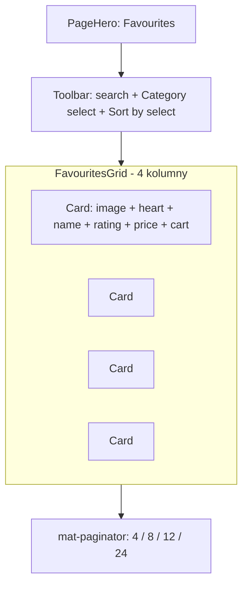
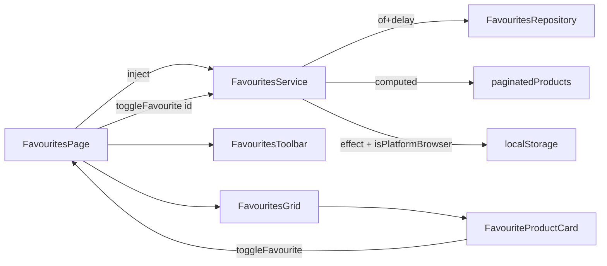

# Plan: ekran Favourites (Figma #4)

**Figma:** [DashStack — ekran #4 (Favourites)](https://www.figma.com/design/x71HmDnhv7Hl8JR6gcCBYk/DashStack---Free-Admin-Dashboard-UI-Kit---Admin---Dashboard-Ui-Kit---Admin-Dashboard--Community-?node-id=0-19507)

**Zakres:** lazy-loaded feature `favourites` z siatką kart produktów (4 kolumny), toolbar (search + sort + filter), persystencja usuniętych ulubionych w `localStorage`, pełne pokrycie testami (Vitest + Playwright + AXE WCAG 2.1 AA).

**Status:** zaimplementowane. Trasa `/favourites` jest dostępna z istniejącego wpisu menu w sidebarze (ikona `las la-heart`).

---

## Kontekst

- Aplikacja jest CSR z hybrydowym SSR (tylko `/login` = Prerender) — Favourites = CSR pod `authGuard`.
- Wpis menu `Favourites` z route `/favourites` już istniał w [src/app/navigation/components/navigation-sidebar-menu/navigation-sidebar-menu.ts](../src/app/navigation/components/navigation-sidebar-menu/navigation-sidebar-menu.ts), brakowało feature'a.
- Stylowanie: design tokeny CSS z [src/styles.scss](../src/styles.scss) (`--bg-card`, `--border-color`, `--text-primary/secondary`, `--kpi-blue/red/orange`); brak SCSS partials.
- Konwencje: standalone components (bez `standalone: true`), `OnPush`, `input()/output()`, signals + `computed()`, `@admin-panel-web/*` aliasy, `.interface.ts` / `.type.ts` colokowane per feature, brak `*.component.` suffixu.

---

## Checklist implementacji

- [x] Lazy route `/favourites` z `authGuard` w [app.routes.ts](../src/app/app.routes.ts)
- [x] Typy: `FavouriteProduct`, `FavouriteProductSortableColumn` + type guard
- [x] `FavouritesRepository` (12 mocków, `of(...).pipe(delay(600))`) + `FavouritesService` (signals state + persystencja w `localStorage`)
- [x] `FavouritesPage` (cztery stany: loading/error/empty/content)
- [x] `FavouritesToolbar` (search + dwa `mat-select`: kategoria, sort)
- [x] `FavouritesGrid` (responsywna 4/3/2/1 kol.) + `FavouriteProductCard` (image, gwiazdki, cena, swatche, heart toggle, add-to-cart)
- [x] Vitest: 65 nowych testów (service, page, card, toolbar, sort util)
- [x] Playwright: 6 testów flow + nowy scenariusz w `accessibility.spec.ts` (AXE WCAG AA = 0 violations)

---

## Docelowy układ (Figma DashStack #4)



**Elementy UI do odwzorowania:**

| Element | Wskazówka ze stylów projektu |
|---------|------------------------------|
| Tło strony | `var(--bg-primary)` (z `app-page-content`) |
| Karta | `var(--bg-card)`, `border: 1px solid var(--border-color)`, `border-radius: 12px`, hover `translateY(-2px)` + cień |
| Obrazek | `aspect-ratio: 1/1`, `object-fit: cover`, `loading="lazy"` |
| Heart toggle | `mat-icon-button` w prawym górnym rogu, `var(--kpi-red)` gdy aktywny |
| Gwiazdki | `las la-star` (pełna), `las la-star-half-alt` (połówka), `lar la-star` (pusta), kolor `var(--kpi-orange)` / `var(--border-color)` |
| Kropki kolorów | `.color-dot` (kalka z `products-stock-table.scss`), `width/height: 16px`, `border-radius: 50%` |
| Cena | bold `var(--text-primary)`, przekreślona `originalPrice` w `var(--text-secondary)` |
| Add to cart | `mat-flat-button` z `background: var(--kpi-blue); color: #fff;`, ikona `las la-shopping-cart` |
| Search | `mat-form-field appearance="outline"` + `<mat-icon matPrefix>search</mat-icon>` (wzorzec z `products-stock-toolbar.html`) |
| Sort / Category | `mat-select` w `mat-form-field` |

---

## Struktura katalogów (zaimplementowana)

Mirror `features/products-stock/`:

```
src/app/features/favourites/
├── favourites.routes.ts
├── pages/favourites-page/
│   ├── favourites-page.ts | .html | .scss | .spec.ts
├── components/
│   ├── favourites-toolbar/                 (search + sort + category)
│   ├── favourites-grid/                    (responsywna siatka)
│   └── favourite-product-card/             (pojedyncza karta z Figmy)
├── services/
│   ├── favourites.service.ts               (signals state, computed, actions)
│   ├── favourites.repository.ts            (12 mock products, of(...).pipe(delay))
│   └── favourites.service.spec.ts
├── types/
│   ├── favourite-product.interface.ts
│   └── favourite-product-sortable-column.type.ts
└── utils/
    └── favourite-product-sort-value.util.ts (+ spec)
```

E2E:

```
e2e-tests/favourites/favourites.spec.ts
e2e-tests/accessibility/accessibility.spec.ts   (uzupełnione o scenariusz /favourites)
```

---

## 1. Routing

W [src/app/app.routes.ts](../src/app/app.routes.ts) (po `products-stock`, przed `**`):

```ts
{
  path: 'favourites',
  canActivate: [authGuard],
  loadChildren: () =>
    import('@admin-panel-web/features/favourites/favourites.routes').then(
      (m) => m.favouritesRoutes,
    ),
},
```

`favourites.routes.ts`:

```ts
export const favouritesRoutes: Routes = [
  { path: '', component: FavouritesPage },
];
```

`navigation-sidebar-menu.ts` — bez zmian (wpis już prowadzi do `/favourites`).

Build potwierdza lazy split: `favourites-routes` 57.90 kB jako osobny chunk.

---

## 2. Typy

`types/favourite-product.interface.ts`:

```ts
export interface FavouriteProduct {
  readonly id: string;
  readonly image: string;
  readonly name: string;
  readonly description: string;
  readonly category: string;
  readonly rating: number;
  readonly reviewCount: number;
  readonly price: number;
  readonly originalPrice: number | null;
  readonly availableColors: string[];
  readonly isFavorite: boolean;
}
```

`types/favourite-product-sortable-column.type.ts` (wzór z `product-stock-sortable-column.type.ts`):

```ts
export const FAVOURITE_PRODUCT_SORTABLE_COLUMNS = [
  'name', 'price', 'rating', 'reviewCount',
] as const;

export type FavouriteProductSortableColumn =
  (typeof FAVOURITE_PRODUCT_SORTABLE_COLUMNS)[number];

export function isFavouriteProductSortableColumn(
  value: string,
): value is FavouriteProductSortableColumn { /* ... */ }
```

---

## 3. Serwisy (signals + repository)

### `FavouritesRepository`

`Observable<FavouriteProduct[]>` z `of(MOCK).pipe(delay(600))`, 12 mockowanych produktów (4 kolumny x 3 wiersze). Obrazki przez `placehold.co` — spójne z `products-stock.repository.ts`, brak dodatkowej infrastruktury.

### `FavouritesService`

Kalka `ProductsStockService` z dodatkowym `toggleFavourite(id)` i filtrowaniem po kategorii.

- Private signals: `_products`, `_loading`, `_error`, `_searchQuery`, `_category`, `_sortActive`, `_sortDirection`, `_pageIndex` (=0), `_pageSize` (=8).
- Public readonly: `products`, `loading`, `error`, `searchQuery`, `category`, `sortActive`, `sortDirection`, `pageIndex`, `pageSize`.
- `computed`:
  - `categories` — unikalne posortowane kategorie z `_products`,
  - `filteredProducts` — odrzuca `isFavorite=false`, potem filtr `category`, potem search po `name`+`description`+`category`,
  - `sortedFilteredProducts` — przez współdzielony `sortByColumn` z `@admin-panel-web/shared/utils`,
  - `paginatedProducts`, `totalCount`, `isEmpty`.
- Actions: `loadFavourites()` (`catchError` + `finalize`, wzór z `DashboardService`), `search`, `changeCategory`, `changeSort`, `changePage`, `toggleFavourite(id)` (`update` z immutable map — nigdy `mutate`).
- Persystencja: `effect()` z `isPlatformBrowser` (wzór z [src/app/shared/services/theme.service.ts](../src/app/shared/services/theme.service.ts)) zapisuje listę `id` usuniętych ulubionych pod kluczem `app-favourites-removed`; `applyStoredRemovals` w `loadFavourites()` przywraca stan po reloadzie.

---

## 4. Komponenty

### `FavouritesPage` (`app-favourites-page`)

Wzór z [src/app/features/products-stock/pages/products-stock-page/products-stock-page.ts](../src/app/features/products-stock/pages/products-stock-page/products-stock-page.ts).

Szkielet template (cztery stany jak w `dashboard-page.html`):

```html
<app-page-content ariaLabelledBy="favourites-heading">
  <app-page-hero
    headingId="favourites-heading"
    title="Favourites"
    description="Your saved products at a glance." />

  @if (favouritesService.loading()) {
    <div class="state-container" role="status">...spinner...</div>
  } @else if (favouritesService.error()) {
    <div class="state-container" role="alert">...retry...</div>
  } @else if (favouritesService.isEmpty()) {
    <div class="state-container" role="status">
      <i class="las la-heart-broken" aria-hidden="true"></i>
      You haven't saved any favourites yet.
    </div>
  } @else {
    <app-favourites-toolbar ... />
    <app-favourites-grid ... />
    <mat-paginator [pageSizeOptions]="[4, 8, 12, 24]" ... />
  }
</app-page-content>
```

`onAddToCart` — `console.log` jako placeholder (wzór z `products-stock-page.ts: onAddProduct`); docelowy koszyk poza zakresem tej iteracji.

### `FavouritesToolbar` (`app-favourites-toolbar`)

Kalka [products-stock-toolbar.ts](../src/app/features/products-stock/components/products-stock-toolbar/products-stock-toolbar.ts) z dwoma dodatkowymi `mat-select`-ami:

- `input.required<string[]>()` `categories`, `input<string>()` `selectedCategory` (default `'all'`), `input<string>()` `selectedSort` (default `'default'`).
- `output<string>() searchChange`, `output<FavouritesSortChange> sortChange`, `output<string> categoryChange`.
- Search: `mat-form-field appearance="outline"` z `<mat-icon matPrefix>search</mat-icon>`, `aria-label="Search favourites by name, description or category"`.
- Sort: opcje `Default`, `Name (A-Z/Z-A)`, `Price (low/high)`, `Highest rated`, `Most reviewed` — emisja `FavouritesSortChange { active, direction }` zgodnie z `SortDirection` Material.
- Category: `mat-select` z opcją "All categories" + dynamiczne kategorie z serwisu.

### `FavouritesGrid` (`app-favourites-grid`)

Cienki wrapper:

```html
<section class="favourites-grid" aria-label="Favourite products">
  @for (product of products(); track product.id) {
    <app-favourite-product-card
      [product]="product"
      (toggleFavourite)="toggleFavourite.emit($event)"
      (addToCart)="addToCart.emit($event)" />
  }
</section>
```

SCSS:

```scss
.favourites-grid {
  display: grid;
  grid-template-columns: repeat(4, 1fr);
  gap: 24px;
  margin-top: 24px;

  @media (max-width: 1280px) { grid-template-columns: repeat(3, 1fr); }
  @media (max-width: 960px)  { grid-template-columns: repeat(2, 1fr); }
  @media (max-width: 600px)  { grid-template-columns: 1fr; }
}
```

### `FavouriteProductCard` (`app-favourite-product-card`)

Najbardziej "Figmowy" komponent. Inputs/outputs:

```ts
public readonly product = input.required<FavouriteProduct>();
public readonly toggleFavourite = output<string>();
public readonly addToCart = output<string>();

protected readonly stars = computed<StarState[]>(() => /* full | half | empty x5 */);
protected readonly hasDiscount = computed(() =>
  this.product().originalPrice !== null
  && this.product().originalPrice! > this.product().price);
protected readonly favouriteAriaLabel = computed(() =>
  this.product().isFavorite
    ? `Remove ${name} from favourites`
    : `Add ${name} to favourites`);
```

Struktura template (`<article aria-labelledby="favourite-{{id}}-heading">`):

- `` — spójne z `products-stock-table.html` (brak `NgOptimizedImage` w obecnej konwencji repo).
- Heart button w prawym górnym rogu obrazka: `mat-icon-button`, `aria-pressed`, dynamiczny `aria-label`, kolor `var(--kpi-red)` gdy `isFavorite`.
- Tytuł `<h3 [id]="cardHeadingId()">`, opis `<p>` z 2-line clamp.
- Rating: pętla `@for` po `stars()`, każda gwiazdka `aria-hidden="true"`, kontener `role="img"` i `aria-label="{rating} out of 5 stars, {reviewCount} reviews"`.
- Color swatches: `.color-dot` ze wspólnym `aria-label="Available colors: ..."` (mapa hex → nazwa: Black/Blue/Green/Red/Orange/White).
- Cena: bold `var(--text-primary)`, opcjonalnie przekreślona `originalPrice` w `var(--text-secondary)`.
- Add to cart: `mat-flat-button` z `var(--kpi-blue)`, ikona `las la-shopping-cart`, `aria-label="Add {name} to cart"`.

Wszystko `class`/`style` binding (nie `ngClass`/`ngStyle`).

---

## 5. Stylowanie (tylko design tokens z `styles.scss`)

- Karta: `background: var(--bg-card); border: 1px solid var(--border-color); border-radius: 12px;`, body padding 16px.
- Obrazek wrapper: `aspect-ratio: 1 / 1; overflow: hidden; position: relative;`.
- Hover: `box-shadow: 0 8px 24px rgba(0,0,0,0.08);` + `transform: translateY(-2px);`.
- Heart aktywny: `color: var(--kpi-red);`; nieaktywny: `color: var(--text-secondary);`.
- Gwiazdki wypełnione: `color: var(--kpi-orange);`, puste: `var(--border-color)`.
- Cena: `color: var(--text-primary); font-weight: 700;`; `original-price`: `color: var(--text-secondary); text-decoration: line-through;`.
- Description: 2 linie z `display: -webkit-box; -webkit-line-clamp: 2; -webkit-box-orient: vertical; overflow: hidden;`.

---

## 6. Dostępność (WCAG 2.1 AA + AXE)

- `<article aria-labelledby="favourite-{id}-heading">` dla każdej karty.
- Heart button: `aria-pressed="true|false"`, dynamiczny `aria-label`.
- Rating: kontener `role="img" aria-label="4.5 out of 5 stars, 320 reviews"`; ikony gwiazdek `aria-hidden="true"`.
- Color swatches: `role="img" aria-label="Available colors: Black, Blue, Green"`; kropki `aria-hidden`.
- Search input: `<input type="search" aria-label="Search favourites by name, description or category">`.
- Loading: `role="status"`, error: `role="alert"`, empty: `role="status"` (wzór z `dashboard-page.html`).
- Skip-link i `<main id="main-content">` mamy z `app-page-content`.
- Weryfikacja: `e2e-tests/accessibility/accessibility.spec.ts` → `expectNoAccessibilityViolations(page)` po `goto('/favourites')`. Wynik: 0 naruszeń.

---

## 7. Testy

### Unit (Vitest, `*.spec.ts` obok plików)

| Plik | Liczba testów | Co pokrywa |
|------|---------------|------------|
| `favourites.service.spec.ts` | 29 | loading happy/error path, filter po search (`it.each`), filter po kategorii, sort `it.each` po wszystkich kolumnach + obu kierunkach, pagination, `toggleFavourite` immutable + isolation, `isEmpty` po wyzerowaniu, persystencja w `localStorage` (`TestBed.flushEffects()` + `getItem`), odtworzenie usuniętych z `localStorage` przy `loadFavourites`, retry czyści error |
| `favourite-product-card.spec.ts` | 12 | render wszystkich pól, discount/no-discount, 5 gwiazdek dla `rating=3.5` (4 wypełnione), aria-label rating zawiera "out of 5" i "reviews", swatche z mapowaną nazwą koloru, `aria-pressed` zmienia się przy `isFavorite`, emisja `toggleFavourite`/`addToCart` z `product.id`, `aria-labelledby` ↔ `<h3 id>` |
| `favourites-toolbar.spec.ts` | 5 | emisja `searchChange` na input, mapowanie `default/name-asc/price-desc/reviewCount-desc` → `{active, direction}`, `categoryChange` (concrete + "all"), ignorowanie nieznanych wartości sort |
| `favourites-page.spec.ts` | 14 | wzór z `dashboard-page.spec.ts` (mock service przez `signal()` + `vi.fn()`), cztery stany (loading/error/empty/content), `retry()` woła `loadFavourites`, forwarding wszystkich akcji do serwisu, mapowanie kategorii `'all'` → `null` |
| `favourite-product-sort-value.util.spec.ts` | 5 | `name`/`price`/`rating`/`reviewCount` + fallback dla nieznanego klucza |

Wynik suite: **212/212 zielone** (65 nowych).

### E2E (Playwright)

`e2e-tests/favourites/favourites.spec.ts` (6 testów, all chromium ok):

- Nawigacja z sidebara (`page.getByRole('treeitem', { name: 'Favourites' })`) → URL + heading + region.
- Render kart z rating i Add-to-cart.
- Search filtruje karty (po `getByRole('heading', { name: ... })`).
- Filter po kategorii (`getByRole('combobox', { name: 'Filter favourites by category' })` → `getByRole('option', { name: 'Fashion' })`).
- Sort po `Price (low to high)` — pierwsza karta = "Ceramic Coffee Mug Set" ($32).
- Heart toggle: kliknięcie `Remove ... from favourites` znika kartę z widoku (efekt `filteredProducts`).

`e2e-tests/accessibility/accessibility.spec.ts` — nowy scenariusz dla `/favourites` (AXE WCAG 2.1 AA = 0 violations).

---

## 8. Asety

Brak nowych plików w `public/`. Mock data używa `placehold.co/240x240` (spójne z `products-stock.repository.ts`) — uniknięto narzutu na `NgOptimizedImage` (wymagałby image loadera albo lokalnych PNG-ów). Konwencja `` jest jednoznaczna w istniejących komponentach (`products-stock-table.html`).

---

## Diagram przepływu



---

## Decyzje implementacyjne

| Pytanie | Decyzja | Uzasadnienie |
|---------|---------|--------------|
| Persystencja `isFavorite` | Tak — `localStorage` (`app-favourites-removed`, lista usuniętych `id`) | Spójne z `ThemeService`; minimalny payload (tylko delta), pełny mock przywracany przy reload |
| `Add to cart` | `output<string>` w karcie → `console.log` w `FavouritesPage` | Wzór z `products-stock-page.ts: onAddProduct`; koszyk poza zakresem iteracji |
| "Add Favourite" CTA w toolbarze | Nie | Na Favorites usuwamy się ikoną serca; CTA pasuje raczej do `/products` (gdzie się dodaje) |
| `NgOptimizedImage` | Nie — `` z `loading="lazy"` | Repo nie konfiguruje image loadera; spójność z `products-stock-table.html` |
| Default `pageSize` | 8 (2 wiersze x 4 kol.) | Pasuje do mocka (12 produktów = 2 strony) i typowego viewportu |
| Domyślny sort | "Default order" (`active=''`, `direction=''`) | Zachowuje kolejność z repozytorium; jawny reset zamiast ukrytego sortu |

---

## Poza zakresem (kolejna iteracja)

- Prawdziwe API i pełna persystencja (nie tylko `isFavorite`).
- Wspólna usługa koszyka (`CartService`) i podpięcie `addToCart`.
- Dodawanie produktów do ulubionych z `/products-stock` (cross-feature handshake).
- Lokalne grafiki w `public/favourites/` + `NgOptimizedImage` z `provideImgixLoader`/własnym loaderem.
- Bulk actions ("clear all favourites", "share list").
- Lazy load obrazków przez `IntersectionObserver` (obecnie `loading="lazy"` wystarcza).
